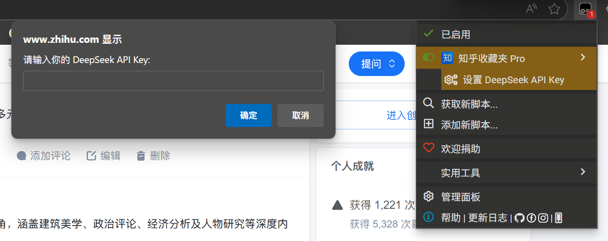
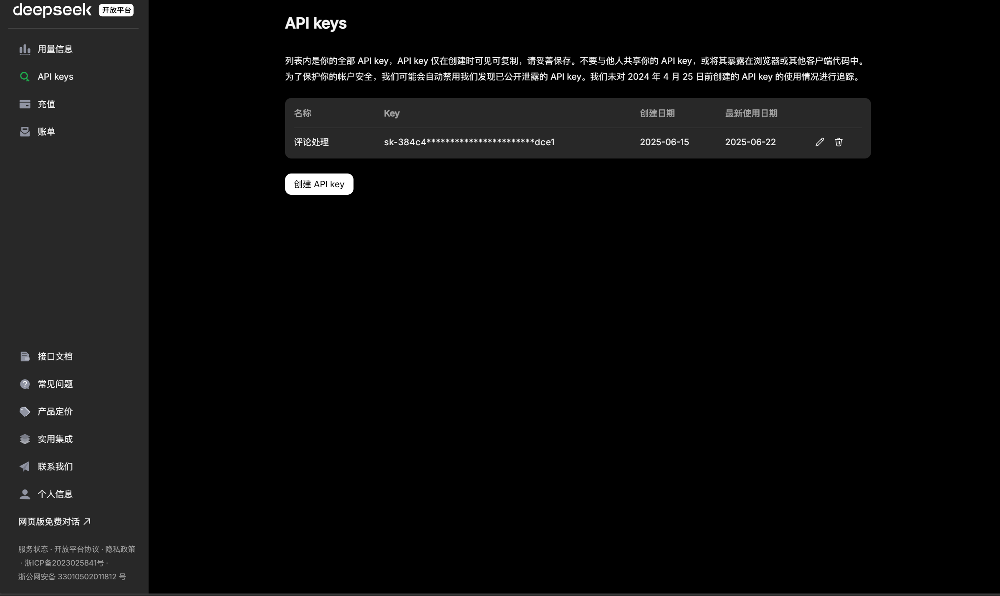
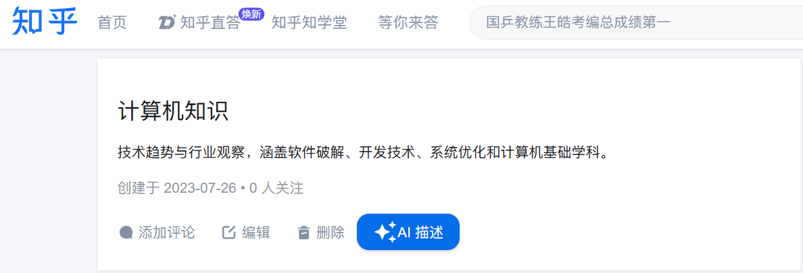
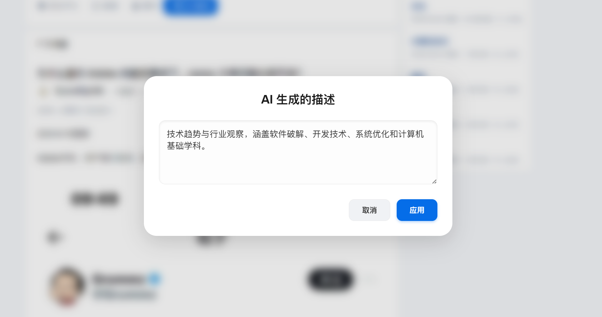
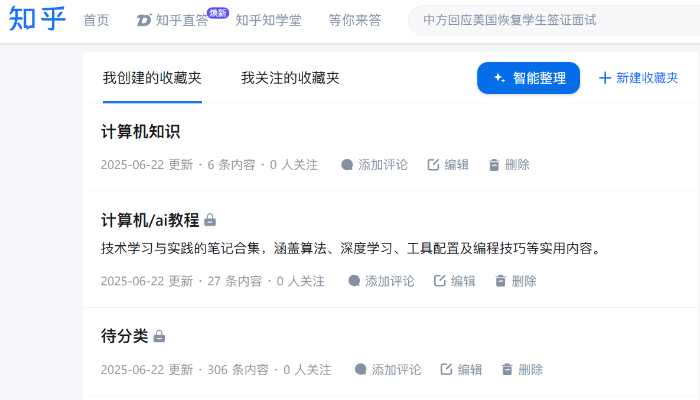
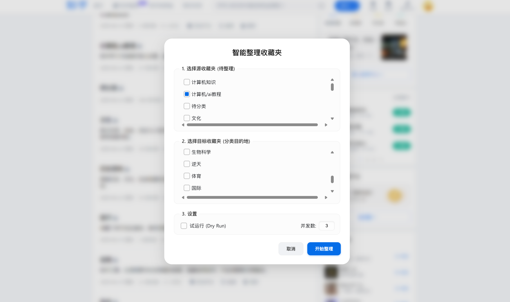
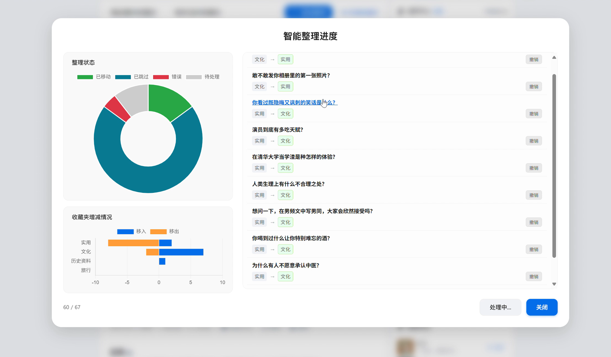

---
# 知乎收藏夹 Pro

  
  
  

「知乎收藏夹 Pro」是一款油猴脚本功能是调用DeepSeek API为知乎收藏夹生成描述，批量分析收藏的回答/专栏文章，并自动移动到最合适的分类收藏夹中
---
## ✨ 功能特性

-   **AI 生成描述**：根据收藏夹内容为收藏夹一键生成摘要
-   **AI 智能整理**：自动分析收藏夹中的内容，并将其移动到最合适的分类收藏夹中，告别手动整理的繁琐
    -  **自定义收藏夹**：支持指定源收藏夹和目标收藏夹 
    -   **交互式仪表盘**：整理过程完全可视化，通过图表和实时日志直观地监控进度，可以通过点击图标筛选具体类别的分类情况，可直接点击标题跳转到具体的文章界面
    -   **试运行 (Dry Run)**：在实际移动任何文件前，先进行一次“试运行”，预览 AI 的所有分类建议，确保操作安全无误
    -   **撤销/重做**：AI 的任何移动操作，都支持单项或批量撤销与重做

---
## 🚀 安装

1.  首先，你需要在浏览器上安装 [Tampermonkey](https://www.tampermonkey.net/) 扩展
2.  然后，点击下方的链接进行安装：

    - **[➡️ 点击此处从 GreasyFork 安装](https://greasyfork.org/zh-CN/scripts/540407-%E7%9F%A5%E4%B9%8E%E6%94%B6%E8%97%8F%E5%A4%B9-pro)** 

    -  或者，你也可以通过拷贝 `release.js` 文件的源码，在 Tampermonkey 管理面板中手动创建新脚本

## 📝 使用指南

### 1. 设置 API Key

本脚本需要使用 [DeepSeek 的 API](https://www.deepseek.com/) 来提供 AI 功能

1.  在浏览器右上角点击 Tampermonkey 扩展图标，在弹出的菜单中找到「知乎收藏夹 Pro」
2.  点击「设置 DeepSeek API Key」子菜单
	
3. 在弹出的对话框中，输入你从[DeepSeek 开放平台](https://platform.deepseek.com/api_keys)获得的API Key并保存

### 2. 功能一：AI 生成描述

1.  进入任意一个你的知乎收藏夹详情页 (例如 `https://www.zhihu.com/collection/123456`)
2.  在收藏夹标题旁边，你会看到一个新增的「**AI 描述**」按钮
    
3.  点击按钮，等待几秒钟，脚本会弹出一个窗口，其中包含了 AI 生成的描述
	

1.  你可以在文本框中直接编辑修改，然后点击「**应用**」保存

### 3. 功能二：AI 智能整理

1.  进入收藏夹列表页 (例如 `https://www.zhihu.com/collections/mine`)
2.  在页面顶部，会看到一个新增的「**智能整理**」按钮
    
3.  点击按钮，会弹出一个设置窗口：
    -   **源收藏夹**: 选择一个或多个你想要整理的收藏夹
    -   **目标收藏夹**: 选择文章可能被归入的分类收藏夹
    -   **设置**:
        -   **试运行 (Dry Run)**: 强烈建议首次使用时勾选此项它只会分析并报告结果，不会实际移动任何文章
        -   **并发数**: 设置同时处理的任务数量，建议保持默认值

​	

4. 点击「**开始整理**」，界面会切换到交互式仪表盘，你可以实时查看整理进度

---

## 🛠️ 实现简介

-   **技术**: `JavaScript (ES11)` + `DeepSeek API`
-   **UI**: 原生 `CSS`，无外部依赖库，以求轻量和风格统一
-   **图表**: `Chart.js`，用于实现交互式仪表盘
-   **内容抓取**: 利用 `GM_xmlhttpRequest` 异步获取文章页面 HTML，并使用 `DOMParser` 解析，以此绕过知乎 API 的 `x-zse-96` 签名限制
-   **并发管理**: 通过简单的 "Worker Pool" 模型控制并发请求数量，防止因请求过快被服务器限制

## 💡 TODO

- [ ] 适配暗色模式 (Dark Mode)
- [ ] 适配更多大模型的API(如 Gemini\Claude……)的选项
  - [ ] 优化prompt等，减少token使用

- [ ] 优化统一代码风格
- [ ] 功能二仪表盘左下y轴的标签类别显示有误，需修复
- [ ] 功能二未兼容收藏在多个收藏夹的情况，这种情况下如果文章同时在收藏夹a、b;仍然会有从a移动到b并报错的问题
- [ ] **[TBD] 功能三：替换知乎原生的收藏按钮，实现收藏时即时 AI 分类建议**

## 🤝 贡献与反馈

欢迎提交 Pull Requests 或在 [Issues](https://github.com/ienone/ZhihuCollectionsPro/issues) 中提出问题和建议

## 📄 许可证
 [MIT](https://github.com/ienone/ZhihuCollectionsPro/blob/main/LICENSE) 
